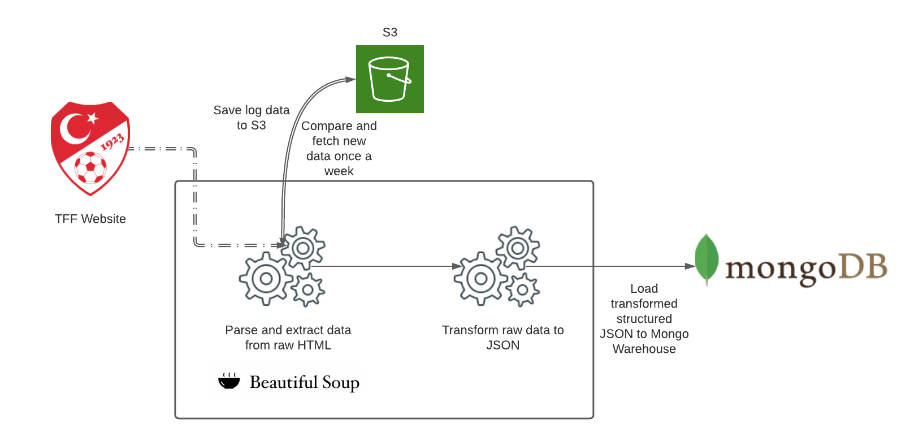

# Turkish Football Events ETL

This is an ETL pipeline to pull Turkish football events (red cards-goals etc.) from Turkish Football Federation website.

## Architecture



An example event document from MongoDB:


I used python to pull, transform and load data. Warehouse is MongoDB. All the components are running as docker containers.
## Setup

### Pre-requisites

1. [Docker](https://docs.docker.com/engine/install/) and [Docker Compose](https://docs.docker.com/compose/install/) v1.27.0 or later.
2. [AWS account](https://aws.amazon.com/).
3. [AWS CLI installed](https://docs.aws.amazon.com/cli/latest/userguide/install-cliv2.html) and [configured](https://docs.aws.amazon.com/cli/latest/userguide/cli-chap-configure.html).
4. [git](https://git-scm.com/book/en/v2/Getting-Started-Installing-Git).

### Local

A [Makefile](Makefile) exists with common commands. These are executed in the running container.

```bash
make up # starts all the containers
make ci # runs formatting, lint check, type check and python test
```

The remaining configs are available in the [.env.dist](.env.dist) file.

### Production

In production instances will run as containers. Thus, for MongoDB port 27017 must be available.


## Tear down

You can spin down your local instance with:

```bash
make down
```
This project inspired from [Designing a Data Project to Impress Hiring Managers](https://www.startdataengineering.com/post/data-engineering-project-to-impress-hiring-managers/#41-formatting-linting-and-type-checks).

